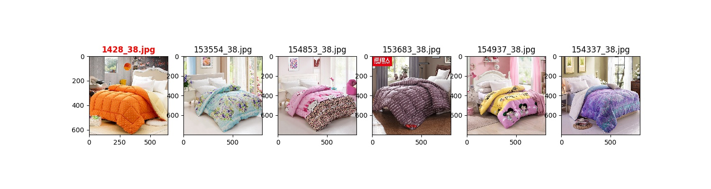
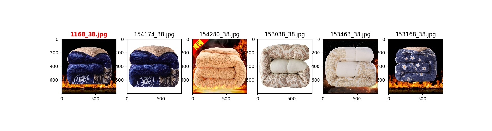
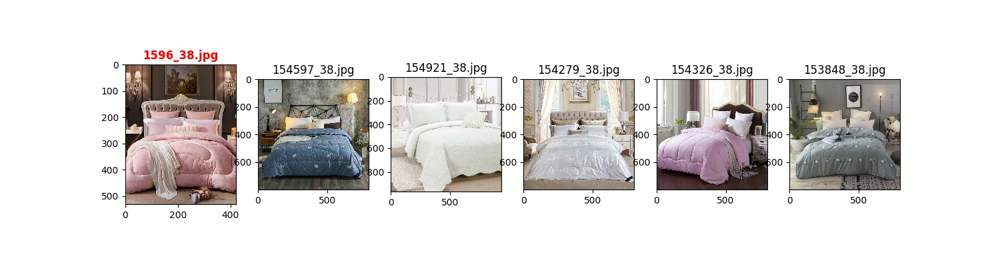

# Image-Retrieval-PyTorch
- The leftmost is the query image and the remaining four which are ordered from left to right by similarity values are the gallery images. 
The upper three row is correct and last one is incorrect.

- It might also be retrieved in the same category elaborately.

## dataset
- download_images.py (about 20GB) from https://www.kaggle.com/c/imaterialist-challenge-furniture-2018
- https://www.kaggle.com/aloisiodn/python-3-download-multi-proc-prog-bar-resume

## References from 
- https://arxiv.org/abs/1812.00442
