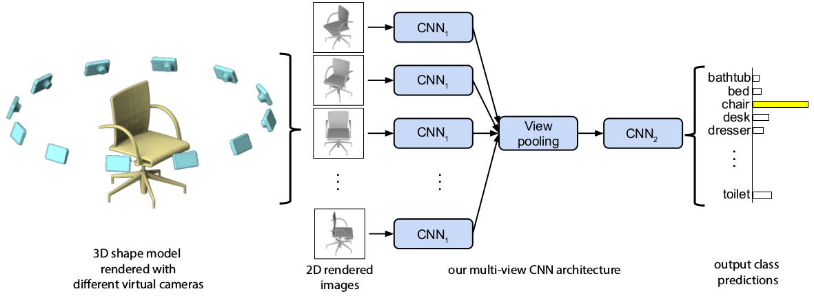

# Image-Retrieval-PyTorch

## dataset
- download_images.py (about 20GB) from https://www.kaggle.com/c/imaterialist-challenge-furniture-2018
- https://www.kaggle.com/aloisiodn/python-3-download-multi-proc-prog-bar-resume

## References from 
- https://arxiv.org/abs/1812.00442
